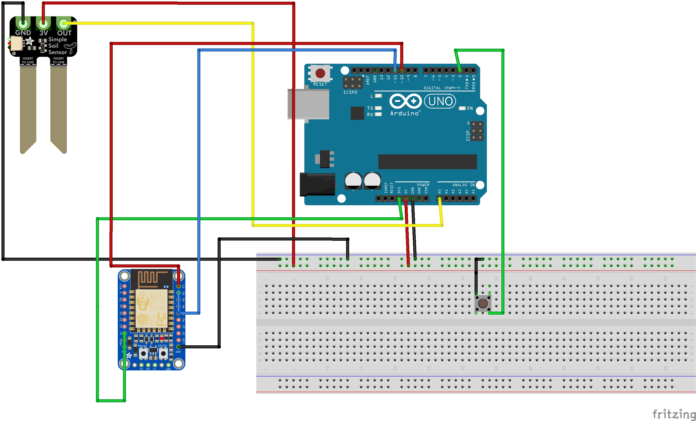

# SaMS-FFD

# Flash flood detection sensor design (Fritzing)

The design illustrates a system for Flash flood detection using rain gauge and soil moisture sensor. The system uses an ESP32 as the central controller, gathering data from the sensors and triggering a remote cloud warning via Wi-Fi. 

**Components and Functions:**
* ESP32
* Capacitive Soil Moisture Sensor
* Pushbutton (Rain Gauge)
* Breadboard

**Wiring Connections:**
* ESP32 **GND** connected to the breadboard blue rail.
* Soil Moisture Sensor: **OUT** Pin to ESP32 **Pin A**, **3V** to ESP32 **3V**, **GND** to the breadboard blue rail.
* Rain Gauge: One leg to ESP32 **Pin 5**, diagonal leg to the breadboard blue rail.

---

# Firmware implementation

The firmware evaluates flash flood risk by comparing precipitation intensity against the current soil moisture. For the evaluation, the implementation uses soil moisture 80% and precipitation 5 tips limit. When the soil moisture and precipitation tips reach, the system sends alert messages to the server.

**Core Logic:**
1. Register interrupt on Pin 5 to listen to precipitation events.
2. Store precipitation data in an array representing a rolling time window. Every second, old data drops off and new data is added to monitor the *rate* of precipitation in the last 10 seconds.
3. Soil saturation - the analog reading from Pin 34 is mapped to a 0-100% soil saturation. 
4. Flash flood risk evaluation: 
   * **NONE:** Soil is able to absorb more precipitation (< 80% saturation).
   * **WARNING:** Soil is highly saturated (>= 80%), but current precipitation intensity is below the 5 tips limit.
   * **ALERT:** Soil is highly saturated (>= 80%) and rolling precipitation intensity is equal or greater than the 5 tips limit.
5. JSON data - the firmware formats the current soil data, rain intensity, and alert status into a standardized JSON string (e.g., `{"node":"ESP32_1", "soil_pct":85, "pre_tips":6, "flood_alert":"true"}`). This payload is transmitted directly over Wi-Fi via an HTTP POST request every 10 seconds to push data to the cloud.

---

# Simulation in Wokwi

The firmware implementation is tested on Wokwi simulation. A simplified setup of the Flash flood detector system proposed in Fritzing is defined using the `diagram.json` file to simulate the components in the design.

**Simulation Setup:**
* **Soil Sensor:** A **Rotary Potentiometer** is wired to Pin 34. By dragging the dial, we csimulate the soil moisture level from 0% to 100% (fully saturated).
* **Rain Gauge:** A **Pushbutton** wired to Pin 5 allows manually trigger the hardware interrupt and simulate precipitation.
* **Flash flood alert over Wi-Fi:** Using Wi-Fi function in ESP32,  JSON payloads are actively sent to a mock server via HTTP POST to prove data transmission over network.

https://wokwi.com/projects/463029982550430721